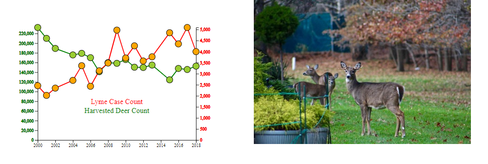

# Lyme Vector Analysis
###Impact of deer population on the Lyme disease.

Lyme disease, named for the town of Old Lyme, Connecticut, is the common term for the infection caused by the bacterial genus Borrelia. While the disease was only first diagnosed in 1975 and the bacteria only isolated in the 1980s, studies of museum specimens have discovered that Lyme disease has been around for over 5,000 years. 

In the US it is estimated that roughly 300,000 individuals are infected every year, with the national hotspot resting primarily on New England an the Mid-Atlantic States.In 2005 Brownstein, Holford, and Fish proposed that North America may see a 213% increase in vector habitat by the year 2080.

Lyme disease can affect a variety of species, includes mice, horses, dogs, and humans. In the wild, mice act as the primary reservoir for the bacteria while deer act largely as hosts for the ticks, with denser deer populations resulting in denser tick populations.

**[Web URL:https://lyme-vector-research.herokuapp.com/](http://https://lyme-vector-research.herokuapp.com/)**

### Technology Stack
#### Data Scraping
- Splinter - web scraping
- Beautiful Soup - web scraping
- Pandas HTML table read - web scraping
- Tabula - PDF table data scraping

#### Cleaning and Normalization
- Pandas - Dataframe manipulation
- numPy - data handling
- Statistics - linear regression for population extrapolation

#### Database Setup and Management
- Flask - local hosting server
- SQLAlchemy - database loading
- Postgres - local database storage
- Heroku Postgres - Heroku database storage

#### Analysis and Visualizations
- d3.js - Interactive Charts
- plotly.js - Pie Charts
- leaflet.js - Choropleth, Heatmap
- Chart.js - Line Charts

#### Dashboard and Website Build
- Heroku - website hosting
- Bootstrap - formatting
- ToolTip and Custom CSS
- AOS - scroll animations

#### Development Environments
- Visual Studio
- PyCharm
- Atom
- Jupyter Notebook

#### Collaboration
- GitHub - version control
- Slack - messaging
- Zoom - video interface, screen sharing

